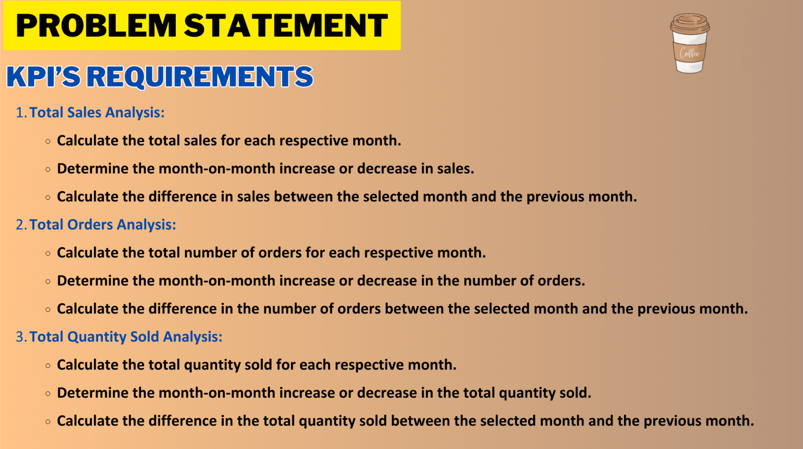
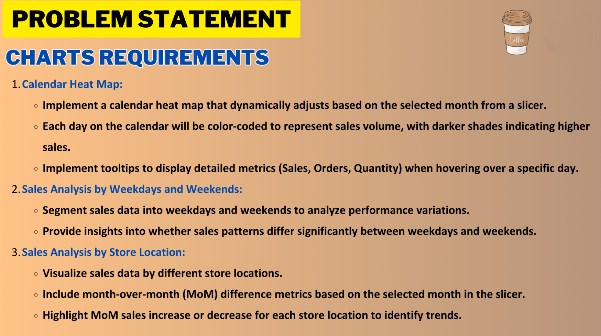
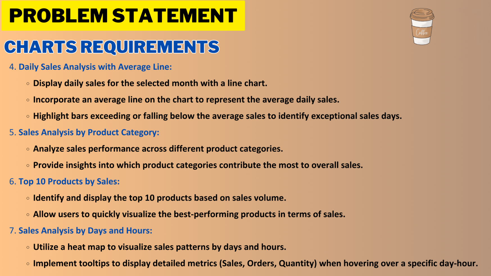

# ☕ Coffee Shop Sales Analysis Dashboard

  

## 📊 Project Overview

The **Coffee Shop Sales Analysis Dashboard** is a comprehensive and interactive report built using **Power BI** to visualize and analyze a coffee shop's sales performance. It covers all critical KPIs including **Total Sales, Total Orders, and Total Quantity Sold**, along with insights by **day, hour, product category, and store location**. The goal is to support business decision-making through data-driven insights and trend analysis.

---

## 📁 Dataset Used

The primary dataset used is:

- **Coffee Shop Sales.xlsx**: Contains a **Transactions table** with detailed sales data including:
  - `transaction_id`, `transaction_date`, `transaction_time`
  - `product_id`, `product_category`, `product_type`, `unit_price`, `transaction_qty`
  - `store_id`, `store_location`
  - Pre-calculated KPIs like `Sales`, `Orders`, `Quantity`, etc.

In addition to the Transactions table, a **custom Date Table** was created in Power BI using **DAX** to enable accurate and flexible time-based analysis. This Date Table includes fields like:
  - `Date`, `Month`, `Year`, `Weekday`, `Weekend`, `Week Number`, `Day Name`, etc.

---

## ✅ KPI Requirements Fulfilled

### 🔹 1. Total Sales Analysis
- Total sales per month
- Month-over-Month (MoM) % increase/decrease
- Difference in sales between selected and previous month

### 🔹 2. Total Orders Analysis
- Monthly total orders
- MoM % comparison
- Difference in orders between months

### 🔹 3. Total Quantity Sold Analysis
- Quantity sold each month
- MoM change in volume sold
- Absolute difference in quantity sold

---

## 📊 Charts & Visualizations Implemented

| Chart Title                         | Description |
|------------------------------------|-------------|
| 📅 **Calendar Heat Map**           | Daily color-coded sales heatmap based on selected month |
| 📈 **Sales Trend Line**            | Daily sales bar chart with average sales reference line |
| 📊 **Sales by Weekday vs Weekend** | Pie chart showing sales split by weekday/weekend |
| 🏪 **Sales by Store Location**     | Bar chart with MoM growth indicators per store |
| 📦 **Sales by Product Category**   | Sales breakdown by product type with % MoM change |
| 🕒 **Sales by Days and Hours**     | Heatmap analyzing hourly sales across weekdays |
| 🏆 **Top-Selling Products**        | (Optional extension): Rank products based on sales volume |

---

## 🧮 Key DAX Measures Created

| Measure Name                            | Purpose |
|-----------------------------------------|---------|
| `Total Sales`, `Total Orders`, `Total Quantity Sold` | Overall aggregation by month |
| `CM Sales`, `PM Sales`, `CM Orders`, `PM Orders`, etc. | Current and previous month values |
| `MoM Growth and Diff Sales`, `MoM Growth and Diff Orders`, `MoM Growth and Diff Quantity` | % change and absolute difference |
| `Daily Avg Sales`, `Hour`, `TT for Hour`, `Weekday / Weekend` | Support fields for analysis by time and category |

---

## 🧱 Data Modeling

- Built a **custom Date Table** using DAX (`CALENDAR`, `FORMAT`, `WEEKDAY`, etc.)
- Established **one-to-many relationship** between Date Table and Transaction Table via `transaction_date`
- Ensured proper formatting, relationships, and data types for time-intelligent analysis

---

## 🧠 Insights Uncovered

- **74.41% of sales** happen on weekdays vs 25.59% on weekends
- **Coffee** is the top-performing category, contributing ~$60.36K in May
- **Hell’s Kitchen** store leads with ~$52.6K sales
- **9 AM to 12 PM** is the peak sales window
- May 2023 showed **~32% MoM growth** in all key metrics (Sales, Orders, Quantity)

---

## 🛠 Tools & Features Used

- ✅ **Power BI Desktop**
- ✅ DAX (Data Analysis Expressions)
- ✅ Slicers, Filters, Custom Tooltips
- ✅ Conditional Formatting & Color Gradients
- ✅ Calendar Heatmap, Bar Charts, Pie Charts, Line Charts, and Matrix Visuals

---

## 📌 Problem Statement Coverage

The dashboard fully addresses all requirements outlined in the provided problem statement:

- ✅ Month-over-month KPI tracking for Sales, Orders, and Quantity
- ✅ Calendar-based sales heatmap
- ✅ Weekday vs Weekend comparison
- ✅ Store location performance breakdown with MoM changes
- ✅ Sales trends with daily average indicators
- ✅ Sales by product category and hourly performance heatmap

  
  
  
  

---

## 🚀 Conclusion

This Power BI dashboard demonstrates the ability to turn raw transactional data into **valuable business insights**. It highlights:

- Effective use of **DAX for KPI calculations**
- Clean and **interactive dashboard design**
- Strong **data modeling and visualization** skills

> ⚡ Built with precision, powered by data, and brewed with creativity.

---

